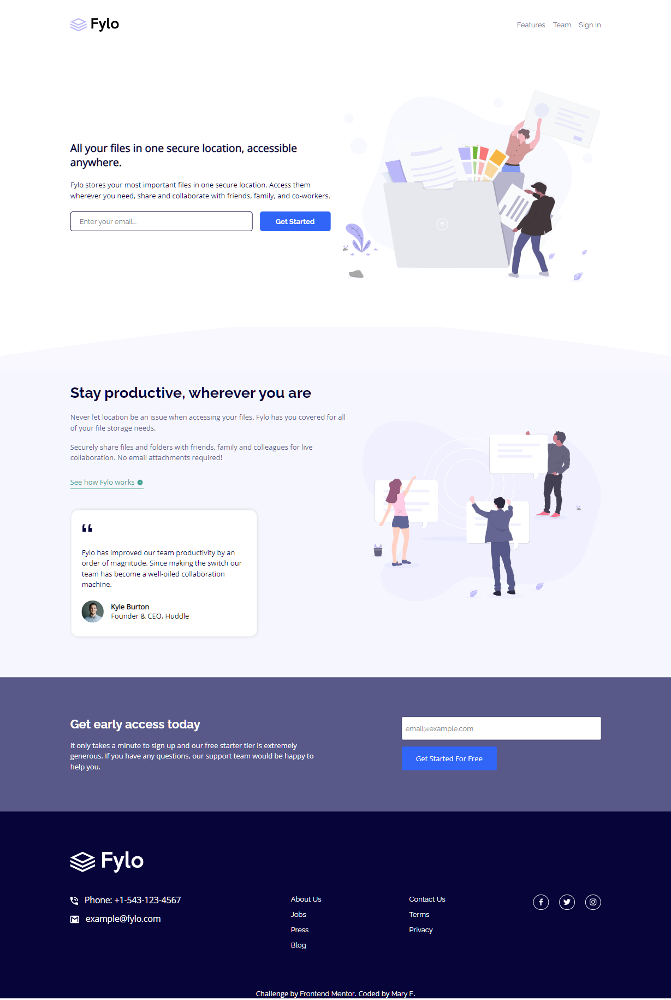

# Frontend Mentor - Fylo landing page with two column layout solution

This is a solution to the [Fylo landing page with two column layout challenge on Frontend Mentor](https://www.frontendmentor.io/challenges/fylo-landing-page-with-two-column-layout-5ca5ef041e82137ec91a50f5). Frontend Mentor challenges help you improve your coding skills by building realistic projects. 

## Table of contents

- [Overview](#overview)
  - [The challenge](#the-challenge)
  - [Screenshot](#screenshot)
 - [My process](#my-process)
  - [Built with](#built-with)
  - [What I learned](#what-i-learned)
  - [Continued development](#continued-development)
- [Author](#author)
- [Acknowledgments](#acknowledgments)

## Overview

### The challenge

Users should be able to:

- View the optimal layout for the site depending on their device's screen size
- See hover states for all interactive elements on the page

### Screenshot

### Links

- Solution URL: (https://github.com/Janselin/fylo-landing-page)
- Live Site URL: (https://janselin.github.io/fylo-landing-page/)

## My process

### Built with

- Semantic HTML5 markup
- CSS custom properties
- Flexbox
- Mobile-first workflow
- BEM

### What I learned

On tis project I've learned many new things🥳:

First time making a website mobile.
First time using custom properties!

### Continued development

I still have to add the email validation message.
And change the color of the svg when on :hover

## Author

- Website - [Add your name here](https://github.com/Janselin)
- Frontend Mentor - [@janselin](https://www.frontendmentor.io/profile/janselin)
- Twitter - [@janselin_](https://www.twitter.com/janselin_)

## Acknowledgments

Been following AlexCGDesign tutorials.
